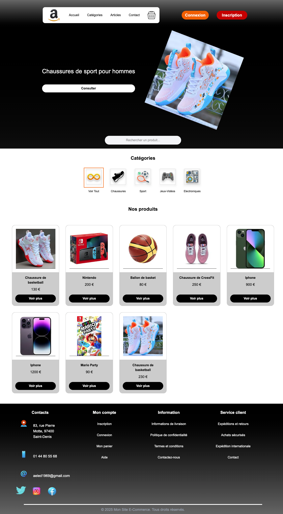
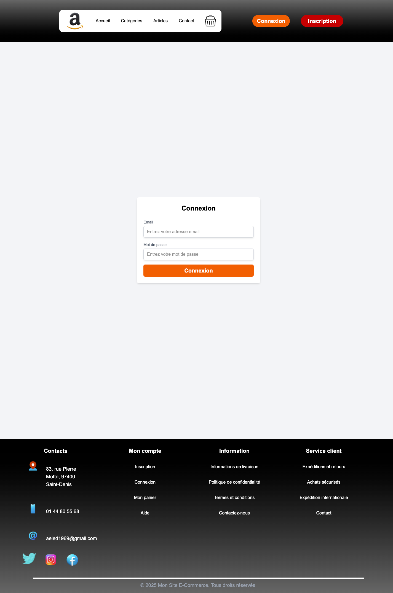
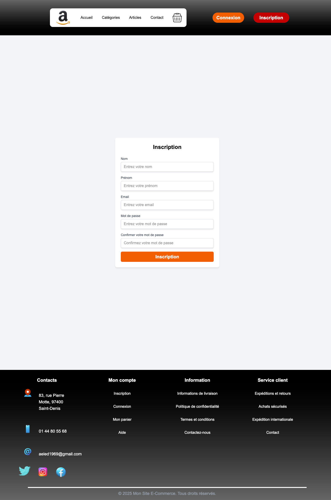
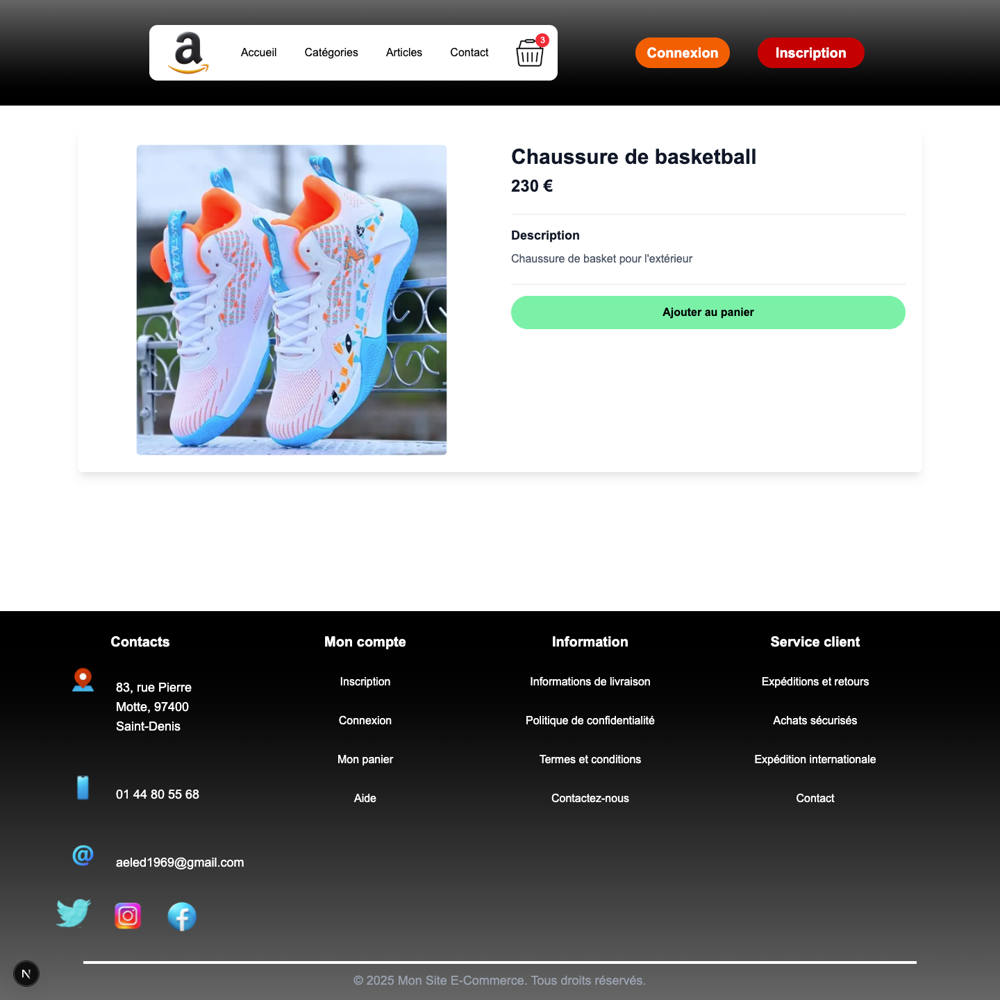
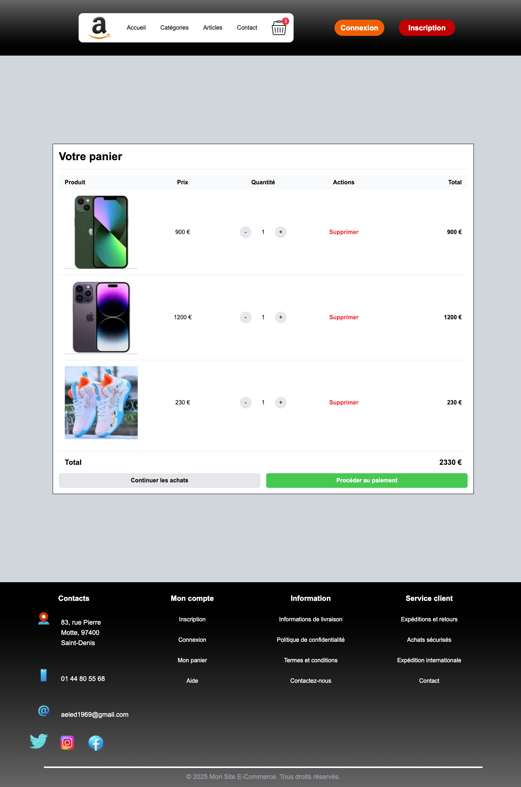
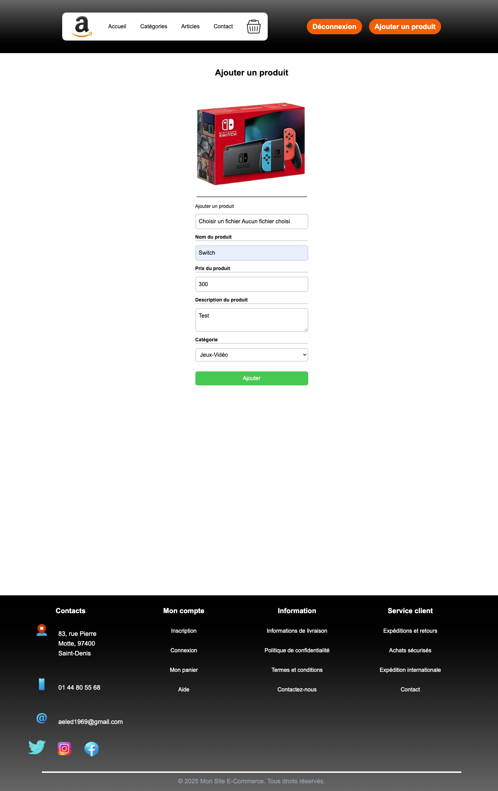
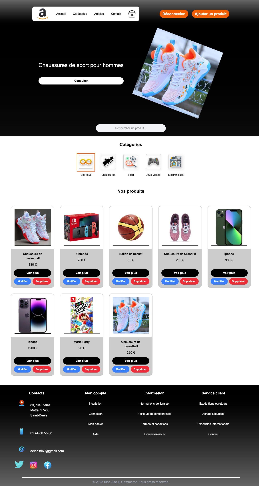

# Mon Site E-Commerce

Un site e-commerce complet développé avec Next.js, TypeScript et Prisma. Ce projet fait partie de ma formation en développement web.

## 📸 Captures d'écran

### Page d'accueil



### Page de connexion



### Page d'inscription



### Page des produits



### Panier



### Interface administrateur




## 🚀 Fonctionnalités

- **Authentification** : Inscription et connexion des utilisateurs
- **Gestion des produits** : Ajout, modification et suppression des produits
- **Panier** : Ajout, modification et suppression d'articles
- **Catégories** : Organisation des produits par catégories
- **Interface administrateur** : Gestion complète des produits

## 🛠 Technologies utilisées

- **Frontend** : Next.js, TypeScript, Tailwind CSS
- **Backend** : API Routes Next.js
- **Base de données** : PostgreSQL avec Prisma
- **Authentification** : JWT avec cookies sécurisés
- **Gestion des images** : Upload et stockage local

## 📦 Installation

1. Cloner le repository :

```bash
git clone [https://github.com/gpaunovic72/Mon-Site-ECommerce]
```

2. Installer les dépendances :

```bash
npm install
```

3. Configurer la base de données :

- Créer un fichier `.env` à la racine
- Ajouter les variables d'environnement nécessaires

4. Lancer le serveur de développement :

```bash
npm run dev
```

## 🎯 Fonctionnalités détaillées

### Authentification

- Inscription avec validation des données
- Connexion avec token JWT
- Protection des routes administrateur
- Gestion des sessions

### Gestion des produits

- CRUD complet des produits
- Upload d'images
- Organisation par catégories
- Interface responsive

### Panier

- Ajout/Suppression de produits
- Modification des quantités
- Persistance des données
- Fusion des paniers lors de la connexion

## 🔒 Sécurité

- Validation des données côté serveur
- Protection contre les injections SQL
- Gestion sécurisée des tokens
- Middleware d'authentification

## 📝 Notes

Ce projet a été développé dans le cadre d'une formation. Il n'est pas destiné à une utilisation en production mais sert de démonstration de mes compétences en développement web.

## 👨‍💻 Auteur

Paunovic Goran

## Learn More

To learn more about Next.js, take a look at the following resources:

- [Next.js Documentation](https://nextjs.org/docs) - learn about Next.js features and API.
- [Learn Next.js](https://nextjs.org/learn) - an interactive Next.js tutorial.

You can check out [the Next.js GitHub repository](https://github.com/vercel/next.js) - your feedback and contributions are welcome!

## Deploy on Vercel

The easiest way to deploy your Next.js app is to use the [Vercel Platform](https://vercel.com/new?utm_medium=default-template&filter=next.js&utm_source=create-next-app&utm_campaign=create-next-app-readme) from the creators of Next.js.

Check out our [Next.js deployment documentation](https://nextjs.org/docs/app/building-your-application/deploying) for more details.
